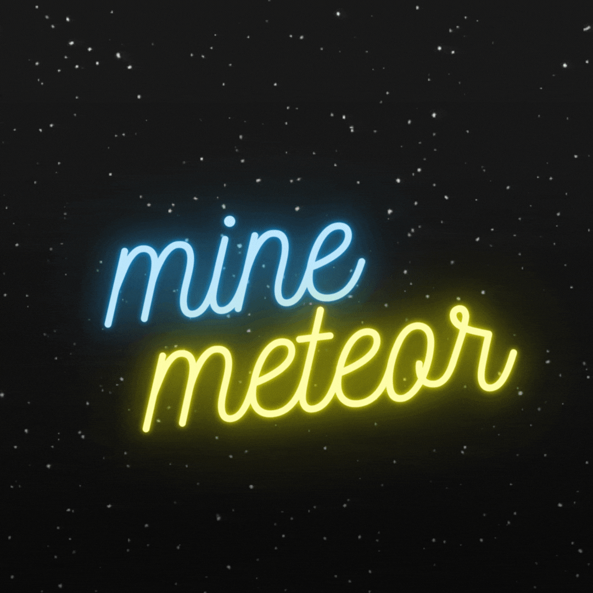

  

# **WELCOME! 🚀**

Hey there, I’m **@Minemetero**, it better to give me a cup of calpis when we meet(probably no......)! 👋

 

**💻 Coding is my Jam:**  
I’m all about diving into the world of bits and bytes, and currently, I'm trying to learn Java because I like Minecraft. 🧙‍♂️ But hey, I'm not stopping there, Python's on my radar too! 🐍

**💞 Seeking Collaborations:**  
While I'm not quite ready to team up just yet, I'm always open to brainstorming and exchanging ideas!

**📫 Reach Me:**  
You can find me buzzing around Discord as **Minemetero**.

**😄 Pronouns:**  
You can call me whatever you like, but I fancy **SUCK<**SILLY**>**. 😄

**⚡ Fun Fact:**  
I might be a bit of a "suck" person... but hey, that just makes life interesting, right? 😎

<!---  --->

**您是第**  **位到访者**  

<picture>
  <source media="(prefers-color-scheme: dark)" srcset="https://raw.githubusercontent.com/Minemetero/Minemetero/output/github-contribution-grid-snake-dark.svg">
  <source media="(prefers-color-scheme: light)" srcset="https://raw.githubusercontent.com/Minemetero/Minemetero/output/github-contribution-grid-snake.svg">
  
</picture>
